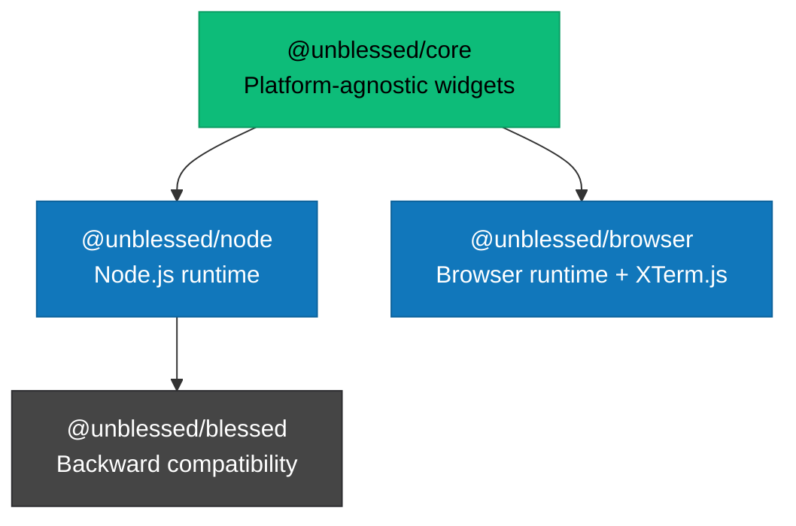

# Architecture

Overview of unblessed's architecture and design principles.

## Core Principles

unblessed is built on three fundamental principles:

1. **Platform-Agnostic Core**: All widget logic lives in `@unblessed/core` with zero platform dependencies
2. **Runtime Dependency Injection**: Platform-specific APIs are injected at runtime, allowing the same code to run anywhere
3. **Modular Packages**: Install only what you need - Node.js runtime, browser runtime, or blessed compatibility

## Package Structure



### @unblessed/core

The platform-agnostic core contains all the TUI logic:

- **Widget system**: Box, List, Table, Form, etc.
- **Rendering engine**: Screen updates and diff algorithms
- **Event handling**: Keyboard, mouse, and custom events
- **Layout engine**: Positioning, sizing, and borders
- **Style system**: Colors, attributes, and themes

**Key characteristic**: Zero platform dependencies. All platform-specific code uses the Runtime interface.

### @unblessed/node

The Node.js runtime implementation:

- **NodeRuntime class**: Implements the Runtime interface using Node.js APIs
- **Auto-initialization**: Sets up runtime on import
- **Re-exports**: All core widgets plus Node-specific features
- **TTY handling**: Direct terminal control via Node.js

**Usage**:

```typescript
import { Screen, Box } from "@unblessed/node";
// Runtime automatically initialized - just use it!
```

### @unblessed/browser

The browser runtime implementation:

- **BrowserRuntime class**: Implements Runtime interface with polyfills
- **XTerm.js integration**: Seamless terminal emulation
- **Auto-initialization**: Sets up runtime and polyfills on import
- **Bundled data**: Includes terminfo data for terminal emulation

**Usage**:

```typescript
import { Screen, Box } from "@unblessed/browser";
import { Terminal } from "xterm";

const term = new Terminal();
term.open(document.getElementById("terminal"));

const screen = new Screen({ terminal: term });
// Runtime automatically initialized - works in browser!
```

### @unblessed/blessed

100% backward-compatible blessed wrapper:

- **Drop-in replacement**: Change import, keep code unchanged
- **Thin wrapper**: Delegates to @unblessed/node
- **Blessed API**: Classic constructor patterns and methods
- **Migration path**: Easy upgrade from blessed to unblessed

**Usage**:

```typescript
// Old blessed code
// import blessed from 'blessed';

// New unblessed code - just change the import!
import blessed from '@unblessed/blessed';

// Everything else works the same
const screen = blessed.screen();
const box = blessed.box({ ... });
```

## Runtime Dependency Injection

The cornerstone of unblessed's cross-platform capability is **runtime dependency injection**.

### The Runtime Interface

The core defines a `Runtime` interface that abstracts all platform-specific APIs:

```typescript
export interface Runtime {
  fs: FileSystemAPI; // File system operations
  process: ProcessAPI; // Process info and events
  tty: TtyAPI; // Terminal control
  buffer: BufferAPI; // Buffer handling
  stream: StreamAPI; // Stream operations
  // ... other platform APIs
}
```

### How It Works

1. **Core code requests runtime**:

```typescript
import { getRuntime } from "@unblessed/core/runtime-context";

// In widget code
const runtime = getRuntime();
const data = runtime.fs.readFileSync(path);
```

2. **Platform package provides runtime**:

```typescript
// @unblessed/node/src/auto-init.ts
import { setRuntime } from "@unblessed/core";
import { NodeRuntime } from "./node-runtime";

setRuntime(new NodeRuntime()); // Injects Node.js implementation
```

3. **Browser uses polyfills**:

```typescript
// @unblessed/browser/src/auto-init.ts
import { setRuntime } from "@unblessed/core";
import { BrowserRuntime } from "./browser-runtime";

setRuntime(new BrowserRuntime()); // Injects browser polyfills
```

### Benefits

- **Single Codebase**: Write once, run anywhere
- **Testability**: Mock runtime for unit tests
- **Extensibility**: Add new platforms (Deno, Bun) by implementing Runtime
- **Zero Dependencies**: Core has no platform dependencies

## Auto-Initialization Pattern

unblessed uses an **auto-initialization** pattern for ergonomics:

```typescript
// ✅ Modern unblessed - just import and use
import { Screen, Box } from "@unblessed/node";
const screen = new Screen();

// ❌ Old pattern - no longer needed
import { initRuntime } from "@unblessed/node";
initRuntime(); // Not required!
```

When you import from `@unblessed/node` or `@unblessed/browser`, the runtime is automatically initialized before any widgets are created.

**Why**: Reduces boilerplate and cognitive load. Users shouldn't think about initialization.

## Widget Hierarchy

Widgets form a tree structure with the Screen at the root:

```
Screen (root)
├── Box (header)
├── List (sidebar)
│   └── Box (list item)
├── Box (content)
└── Box (footer)
```

### Parent-Child Attachment

Widgets attach to parents using the `parent` option:

```typescript
const box = new Box({
  parent: screen, // Attach to screen
  content: "Hello",
});

// Child automatically added to parent.children
console.log(screen.children.includes(box)); // true
```

### Benefits

- **Automatic rendering**: Children render when parent renders
- **Event bubbling**: Events propagate through the tree
- **Coordinate system**: Child positions relative to parent
- **Z-index management**: Paint order determined by tree

## Rendering Pipeline

unblessed uses a smart rendering pipeline:

1. **Dirty tracking**: Only re-render changed widgets
2. **Screen diff**: Calculate minimal terminal updates
3. **Smart CSR**: Use scroll regions when possible
4. **Buffer optimization**: Minimize escape sequences

```typescript
box.setContent("New content"); // Marks box as dirty
screen.render(); // Only updates changed regions
```

See [Rendering](./rendering) for details.

## Event System

unblessed provides a rich event system:

- **DOM-like events**: `focus`, `blur`, `click`, `keypress`
- **Custom events**: Define your own with `.emit()`
- **Event bubbling**: Events propagate up the widget tree
- **Key handlers**: Global and widget-specific key bindings

```typescript
// Widget event
box.on("click", () => console.log("Clicked!"));

// Global key
screen.key("C-c", () => process.exit(0));

// Custom event
box.emit("custom-event", data);
```

See [Events](./events) for details.

## TypeScript Integration

unblessed is built with TypeScript in strict mode:

- **Full type safety**: All widgets and options are typed
- **IntelliSense**: IDE autocomplete and documentation
- **Compile-time errors**: Catch mistakes early
- **Generic support**: Type-safe custom widgets

```typescript
import { Box, type BoxOptions } from "@unblessed/node";

// Full type checking
const options: BoxOptions = {
  top: "center",
  left: "center",
  width: "50%",
  height: 10,
  border: { type: "line" },
  style: { fg: "cyan" },
};

const box = new Box(options);
```

## Performance Considerations

unblessed is designed for performance:

- **Lazy rendering**: Only compute what's visible
- **Smart diffing**: Minimal terminal updates
- **Event batching**: Coalesce rapid updates
- **Memory pooling**: Reuse buffers when possible

**Benchmarks** (on modern hardware):

- Empty screen render: ~6.5ms
- Complex screen (100 boxes): ~11ms
- Large list (1K items): ~187ms

See [Performance](../advanced/performance) for optimization tips.

## Next Steps

- [Runtime System](./runtime-system) - Deep dive into runtime injection
- [Widgets](./widgets) - Understanding the widget system
- [Rendering](./rendering) - How rendering works
- [Events](./events) - Event handling and propagation
