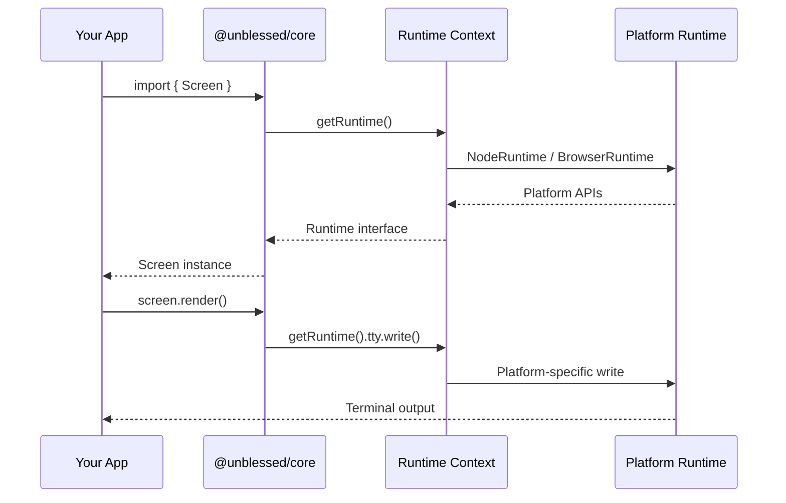

# Runtime System

Deep dive into unblessed's runtime dependency injection system.

## Overview

The runtime system is the key to unblessed's cross-platform capability. It allows the same widget code to run in Node.js, browsers, and potentially other platforms like Deno or Bun.



## The Runtime Interface

All platform-specific APIs are abstracted behind the `Runtime` interface:

```typescript
export interface Runtime {
  fs: FileSystemAPI;
  process: ProcessAPI;
  tty: TtyAPI;
  buffer: BufferAPI;
  stream: StreamAPI;
  colors: ColorsAPI;
  unicode: UnicodeAPI;
  nextTick: (callback: () => void) => void;
}
```

### API Categories

#### FileSystemAPI

Abstracts file system operations:

```typescript
interface FileSystemAPI {
  readFileSync(path: string, encoding?: string): string | Buffer;
  existsSync(path: string): boolean;
  statSync(path: string): { isDirectory(): boolean; isFile(): boolean };
  // ... other fs methods
}
```

#### ProcessAPI

Abstracts process information and control:

```typescript
interface ProcessAPI {
  platform: string;
  env: Record<string, string | undefined>;
  cwd(): string;
  exit(code?: number): never;
  on(event: string, listener: Function): void;
  // ... other process methods
}
```

#### TtyAPI

Abstracts terminal control:

```typescript
interface TtyAPI {
  isatty(fd: number): boolean;
  getWindowSize(): [number, number];
  setRawMode(mode: boolean): void;
  write(data: string | Buffer): void;
  // ... other TTY methods
}
```

#### BufferAPI

Abstracts buffer handling:

```typescript
interface BufferAPI {
  Buffer: typeof Buffer;
  from(data: string | ArrayBuffer, encoding?: string): Buffer;
  alloc(size: number): Buffer;
  concat(buffers: Buffer[]): Buffer;
  // ... other buffer methods
}
```

## Using the Runtime

### In Core Code

All core code accesses platform APIs through the runtime:

```typescript
import { getRuntime } from "@unblessed/core/runtime-context";

export class MyWidget extends Element {
  loadData(filename: string) {
    const runtime = getRuntime();

    // Use runtime instead of direct `fs` import
    if (runtime.fs.existsSync(filename)) {
      const data = runtime.fs.readFileSync(filename, "utf8");
      this.setContent(data);
    }
  }
}
```

**Why**: This allows the same widget to work in Node.js (using real `fs`) and browsers (using polyfills).

### Runtime Context

The runtime is stored in a global context:

```typescript
// runtime-context.ts
let globalRuntime: Runtime | null = null;

export function setRuntime(runtime: Runtime): void {
  globalRuntime = runtime;
}

export function getRuntime(): Runtime {
  if (!globalRuntime) {
    throw new Error("Runtime not initialized");
  }
  return globalRuntime;
}
```

## Platform Implementations

### Node.js Runtime

`@unblessed/node` provides a Node.js implementation:

```typescript
// node-runtime.ts
import fs from "fs";
import process from "process";
import tty from "tty";

export class NodeRuntime implements Runtime {
  fs = {
    readFileSync: fs.readFileSync.bind(fs),
    existsSync: fs.existsSync.bind(fs),
    statSync: fs.statSync.bind(fs),
    // ... other fs methods
  };

  process = {
    platform: process.platform,
    env: process.env,
    cwd: process.cwd.bind(process),
    exit: process.exit.bind(process),
    on: process.on.bind(process),
    // ... other process methods
  };

  tty = {
    isatty: tty.isatty.bind(tty),
    // ... other TTY methods
  };

  // ... other runtime APIs
}
```

### Browser Runtime

`@unblessed/browser` provides polyfills:

```typescript
// browser-runtime.ts
import { Buffer } from "buffer";

export class BrowserRuntime implements Runtime {
  fs = {
    readFileSync: (path: string) => {
      // Use bundled terminfo data or throw error
      const data = BUNDLED_FILES[path];
      if (!data) {
        throw new Error(`File not found: ${path}`);
      }
      return data;
    },
    existsSync: (path: string) => {
      return path in BUNDLED_FILES;
    },
    // ... other polyfilled fs methods
  };

  process = {
    platform: "browser",
    env: {},
    cwd: () => "/",
    exit: (code?: number) => {
      throw new Error("process.exit() not supported in browser");
    },
    on: (event: string, listener: Function) => {
      // Browser event handling
    },
    // ... other polyfilled process methods
  };

  buffer = {
    Buffer: Buffer,
    from: Buffer.from.bind(Buffer),
    alloc: Buffer.alloc.bind(Buffer),
    // ... other buffer methods
  };

  // ... other runtime APIs
}
```

## Auto-Initialization

Each platform package auto-initializes the runtime on import:

```typescript
// @unblessed/node/src/auto-init.ts
import { setRuntime } from "@unblessed/core";
import { NodeRuntime } from "./node-runtime";

// Initialize runtime when package is imported
setRuntime(new NodeRuntime());
```

```typescript
// @unblessed/node/src/index.ts
import "./auto-init"; // Runs first
export * from "@unblessed/core"; // Then export widgets
```

When you import from `@unblessed/node`, the runtime is set up before any widgets are created.

## Testing with Mock Runtimes

The runtime system makes testing easy with mock implementations:

```typescript
import { setRuntime } from "@unblessed/core";

const mockRuntime: Runtime = {
  fs: {
    readFileSync: vi.fn(() => "mock data"),
    existsSync: vi.fn(() => true),
    // ... other mocked methods
  },
  process: {
    platform: "test",
    env: {},
    // ... other mocked methods
  },
  // ... other mock APIs
};

beforeEach(() => {
  setRuntime(mockRuntime);
});
```

## Adding New Platforms

To support a new platform (e.g., Deno):

### 1. Create Runtime Implementation

```typescript
// @unblessed/deno/src/deno-runtime.ts
import { Runtime } from "@unblessed/core";

export class DenoRuntime implements Runtime {
  fs = {
    readFileSync: (path: string, encoding?: string) => {
      return Deno.readTextFileSync(path);
    },
    existsSync: (path: string) => {
      try {
        Deno.statSync(path);
        return true;
      } catch {
        return false;
      }
    },
    // ... implement other fs methods
  };

  process = {
    platform: Deno.build.os,
    env: Deno.env.toObject(),
    cwd: Deno.cwd.bind(Deno),
    // ... implement other process methods
  };

  // ... implement other runtime APIs
}
```

### 2. Auto-Initialize

```typescript
// @unblessed/deno/src/auto-init.ts
import { setRuntime } from "@unblessed/core";
import { DenoRuntime } from "./deno-runtime";

setRuntime(new DenoRuntime());
```

### 3. Export Widgets

```typescript
// @unblessed/deno/src/index.ts
import "./auto-init";
export * from "@unblessed/core";
```

Now unblessed works in Deno!

## Runtime Environment Detection

Sometimes you need to detect the current platform:

```typescript
import { getRuntime } from "@unblessed/core/runtime-context";

const runtime = getRuntime();

if (runtime.process.platform === "browser") {
  // Browser-specific code
} else if (runtime.process.platform === "darwin") {
  // macOS-specific code
}
```

## Advanced: Runtime Capabilities

Check if specific features are available:

```typescript
function supportsColor(): boolean {
  const runtime = getRuntime();
  return runtime.tty?.isatty?.(1) ?? false;
}

function hasFileSystem(): boolean {
  const runtime = getRuntime();
  try {
    runtime.fs.existsSync("/");
    return true;
  } catch {
    return false;
  }
}
```

## Benefits

### Cross-Platform Code

Write once, run anywhere:

```typescript
// This widget works in Node.js AND browsers
export class FileViewer extends Box {
  loadFile(path: string) {
    const runtime = getRuntime();
    const content = runtime.fs.readFileSync(path, "utf8");
    this.setContent(content);
  }
}
```

### Testability

Easy to mock and test:

```typescript
test("FileViewer loads file", () => {
  const mockFs = {
    readFileSync: vi.fn(() => "test content"),
  };
  setRuntime({ ...mockRuntime, fs: mockFs });

  const viewer = new FileViewer();
  viewer.loadFile("/test.txt");

  expect(mockFs.readFileSync).toHaveBeenCalledWith("/test.txt", "utf8");
  expect(viewer.content).toBe("test content");
});
```

### Future-Proof

Easy to add new platforms without changing core code.

## Next Steps

- [Architecture](./architecture) - Overall architecture overview
- [Widgets](./widgets) - Understanding widgets
- [Platform Guides](/docs/platforms/nodejs) - Platform-specific features
