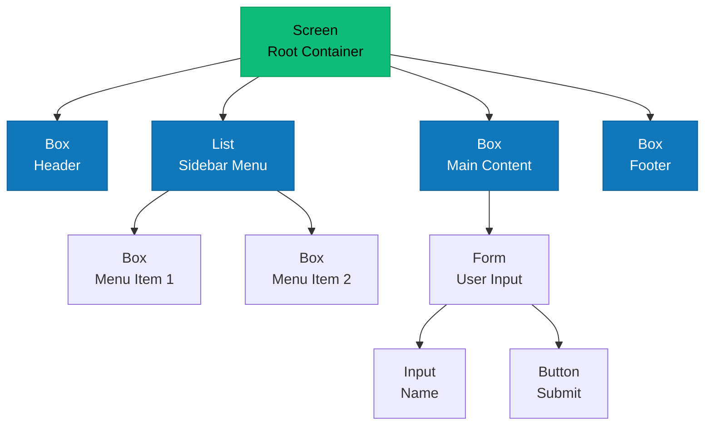

# Widgets

Understanding unblessed's widget system.

## Overview

Widgets are the building blocks of unblessed TUIs. They provide UI elements like boxes, lists, forms, and more, all arranged in a hierarchical tree structure.

## Widget Hierarchy



All widgets inherit from the base classes:

```
Node (base class)
└── Element (visual base)
    ├── Box (rectangular area)
    │   ├── List (scrollable list)
    │   ├── Form (input container)
    │   ├── Table (tabular data)
    │   └── Text (formatted text)
    ├── Input (text input)
    │   ├── Textbox (single-line)
    │   └── Textarea (multi-line)
    ├── Button (clickable button)
    ├── ProgressBar (progress indicator)
    └── ... (other widgets)
```

### Node

The base class for all widgets:

```typescript
class Node {
  parent: Node | null;
  children: Node[];
  screen: Screen | null;

  // Hierarchy methods
  append(node: Node): void;
  prepend(node: Node): void;
  insertBefore(node: Node, ref: Node): void;
  insertAfter(node: Node, ref: Node): void;
  remove(node: Node): void;
  detach(): void;

  // Event methods
  on(event: string, listener: Function): void;
  emit(event: string, ...args: any[]): void;
}
```

### Element

Adds visual properties to Node:

```typescript
class Element extends Node {
  // Position
  top: number | string;
  left: number | string;
  width: number | string;
  height: number | string;

  // Style
  style: Style;
  border: BorderOptions;
  padding: Padding;

  // Content
  content: string;
  tags: boolean; // Enable tag parsing

  // Methods
  render(): void;
  setContent(text: string): void;
  focus(): void;
  hide(): void;
  show(): void;
}
```

## Core Widgets

### Box

The fundamental rectangular widget:

```typescript
import { Box } from "@unblessed/node";

const box = new Box({
  parent: screen,
  top: "center",
  left: "center",
  width: "50%",
  height: "50%",
  content: "Hello {bold}World{/bold}!",
  tags: true,
  border: { type: "line" },
  style: {
    fg: "white",
    bg: "blue",
    border: { fg: "cyan" },
  },
});
```

**Use cases**: Headers, containers, panels, status bars

### List

Interactive scrollable list:

```typescript
import { List } from "@unblessed/node";

const list = new List({
  parent: screen,
  top: 0,
  left: 0,
  width: "100%",
  height: "100%",
  items: ["Item 1", "Item 2", "Item 3"],
  keys: true, // Arrow key navigation
  vi: true, // Vim bindings (j/k)
  mouse: true, // Mouse support
  style: {
    selected: {
      bg: "cyan",
      fg: "black",
    },
  },
});

list.on("select", (item, index) => {
  console.log(`Selected: ${item.getText()}`);
});
```

**Use cases**: Menus, file browsers, selection lists

### Table

Tabular data display:

```typescript
import { Table } from "@unblessed/node";

const table = new Table({
  parent: screen,
  top: 0,
  left: 0,
  width: "100%",
  height: "100%",
  data: [
    ["Name", "Age", "City"],
    ["Alice", "30", "New York"],
    ["Bob", "25", "London"],
    ["Carol", "35", "Tokyo"],
  ],
  border: { type: "line" },
  style: {
    header: { fg: "blue", bold: true },
    cell: { fg: "white" },
  },
});
```

**Use cases**: Data tables, grids, reports

### Form

Container for input widgets:

```typescript
import { Form, Textbox, Button } from "@unblessed/node";

const form = new Form({
  parent: screen,
  keys: true,
  mouse: true,
});

const nameInput = new Textbox({
  parent: form,
  name: "name",
  label: "Name:",
  top: 0,
  left: 0,
  width: "100%",
  height: 3,
});

const submitButton = new Button({
  parent: form,
  content: "Submit",
  top: 4,
  left: 0,
  height: 3,
});

form.on("submit", (data) => {
  console.log("Form data:", data);
});

submitButton.on("press", () => {
  form.submit();
});
```

**Use cases**: User input, settings, dialogs

### Textbox & Textarea

Text input widgets:

```typescript
import { Textbox, Textarea } from "@unblessed/node";

// Single-line input
const textbox = new Textbox({
  parent: screen,
  label: "Username:",
  inputOnFocus: true,
  keys: true,
  mouse: true,
});

// Multi-line input
const textarea = new Textarea({
  parent: screen,
  label: "Description:",
  inputOnFocus: true,
  keys: true,
  mouse: true,
});

textbox.on("submit", (value) => {
  console.log("Entered:", value);
});
```

**Use cases**: Text input, forms, editors

### Button

Clickable button:

```typescript
import { Button } from "@unblessed/node";

const button = new Button({
  parent: screen,
  content: "Click Me",
  top: "center",
  left: "center",
  width: 20,
  height: 3,
  mouse: true,
  style: {
    bg: "green",
    fg: "white",
    focus: { bg: "cyan" },
  },
});

button.on("press", () => {
  console.log("Button clicked!");
});
```

**Use cases**: Actions, confirmations, navigation

### ProgressBar

Progress indicator:

```typescript
import { ProgressBar } from "@unblessed/node";

const progress = new ProgressBar({
  parent: screen,
  top: "center",
  left: "center",
  width: "50%",
  height: 3,
  filled: 0,
  style: { bar: { bg: "cyan" } },
});

let value = 0;
const interval = setInterval(() => {
  value += 10;
  progress.setProgress(value);
  screen.render();

  if (value >= 100) {
    clearInterval(interval);
  }
}, 100);
```

**Use cases**: Loading indicators, task progress

## Widget Options

### Common Options

All widgets support these options:

```typescript
interface WidgetOptions {
  // Hierarchy
  parent?: Node;
  children?: Node[];

  // Position (numbers or strings)
  top?: number | string; // 0, '50%', 'center'
  left?: number | string;
  right?: number | string;
  bottom?: number | string;

  // Size
  width?: number | string; // 50, '50%', 'shrink'
  height?: number | string;

  // Visual
  border?: BorderOptions;
  padding?: Padding;
  style?: Style;

  // Content
  content?: string;
  tags?: boolean; // Enable {bold}, {red-fg}, etc.
  label?: string;

  // Behavior
  hidden?: boolean;
  clickable?: boolean;
  focusable?: boolean;
  scrollable?: boolean;
  draggable?: boolean;
  mouse?: boolean;
  keys?: boolean;
  vi?: boolean;
}
```

### Position & Sizing

Flexible positioning system:

```typescript
// Absolute
{ top: 0, left: 0, width: 50, height: 10 }

// Percentage
{ top: '10%', left: '20%', width: '50%', height: '80%' }

// Center
{ top: 'center', left: 'center', width: 30, height: 10 }

// Mixed
{ top: 2, left: 'center', width: '50%', height: 10 }

// Calculated
{ top: 0, left: 0, right: 0, bottom: 0 }  // Fill parent
{ width: '100%-10', height: '100%-5' }    // With margin
```

### Borders

Various border styles:

```typescript
// Line border
{ border: { type: 'line' } }

// Custom characters
{ border: {
    type: 'line',
    ch: '#',
    top: true,
    bottom: true,
    left: true,
    right: true
  }
}

// Colors
{ border: { type: 'line' },
  style: { border: { fg: 'cyan', bg: 'black' } }
}
```

### Padding

Space inside borders:

```typescript
// Uniform
{ padding: 1 }

// Per side
{ padding: { left: 2, right: 2, top: 1, bottom: 1 } }
```

### Styles

Colors and attributes:

```typescript
{
  style: {
    fg: 'white',           // Foreground color
    bg: 'blue',            // Background color
    bold: true,
    underline: true,
    border: {
      fg: 'cyan'
    },
    focus: {               // When focused
      bg: 'yellow',
      fg: 'black'
    },
    selected: {            // For lists
      bg: 'green'
    }
  }
}
```

**Colors**: Named colors (`'red'`, `'blue'`, etc.), RGB (`'#ff0000'`), or terminal codes.

## Content Tags

Enable rich content formatting with `tags: true`:

```typescript
const box = new Box({
  parent: screen,
  content:
    "{bold}Bold text{/bold}\n" +
    "{red-fg}Red text{/red-fg}\n" +
    "{blue-bg}Blue background{/blue-bg}\n" +
    "{center}Centered{/center}",
  tags: true,
});
```

**Available tags**:

- Style: `{bold}`, `{underline}`, `{blink}`, `{inverse}`
- Colors: `{red-fg}`, `{blue-bg}`, `{#ff0000-fg}`
- Alignment: `{left}`, `{center}`, `{right}`
- Reset: `{/bold}`, `{/red-fg}`, `{/}`

## Creating Custom Widgets

Extend existing widgets to create custom ones:

```typescript
import { Box, type BoxOptions } from "@unblessed/node";

export interface StatusBoxOptions extends BoxOptions {
  status?: "success" | "error" | "warning";
}

export class StatusBox extends Box {
  constructor(options: StatusBoxOptions = {}) {
    super(options);
    this.type = "statusbox";

    // Set colors based on status
    if (options.status) {
      this.setStatus(options.status);
    }
  }

  setStatus(status: "success" | "error" | "warning") {
    const colors = {
      success: { fg: "green", border: "green" },
      error: { fg: "red", border: "red" },
      warning: { fg: "yellow", border: "yellow" },
    };

    const color = colors[status];
    this.style.fg = color.fg;
    if (this.border) {
      this.style.border = { fg: color.border };
    }
  }
}

// Usage
const status = new StatusBox({
  parent: screen,
  status: "success",
  content: "Operation completed successfully!",
  border: { type: "line" },
});
```

See [Custom Widgets](../advanced/custom-widgets) for advanced examples.

## Widget Lifecycle

Understanding widget lifecycle helps with proper resource management:

1. **Construction**: Widget options processed
2. **Attachment**: Added to parent, assigned screen
3. **Rendering**: Visual output generated
4. **Events**: User interactions handled
5. **Updates**: Content/style changes
6. **Detachment**: Removed from parent
7. **Destruction**: Resources cleaned up

```typescript
const box = new Box({
  /* options */
}); // 1. Construction
box.attach(parent); // 2. Attachment
screen.render(); // 3. Rendering
box.on("click", handler); // 4. Events
box.setContent("new content"); // 5. Updates
box.detach(); // 6. Detachment
box.destroy(); // 7. Destruction
```

## Best Practices

### Use Parent Option

```typescript
// ✅ Recommended
const box = new Box({ parent: screen });

// ❌ Avoid
const box = new Box();
screen.append(box);
```

### Batch Updates

```typescript
// ✅ Efficient
box.setContent("Line 1");
box.style.fg = "cyan";
screen.render(); // Single render

// ❌ Inefficient
box.setContent("Line 1");
screen.render();
box.style.fg = "cyan";
screen.render();
```

### Clean Up Resources

```typescript
// Remove event listeners
box.removeAllListeners();

// Detach from tree
box.detach();

// Destroy widget
box.destroy();
```

## Next Steps

- [Rendering](./rendering) - How widgets are rendered
- [Events](./events) - Event handling
- [Widget API Reference](/docs/api/generated/widgets.box.Class.Box) - Detailed API docs
- [Custom Widgets](../advanced/custom-widgets) - Build your own
